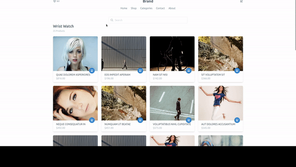

# Watch Store - Vue :fire:

Projeto feito utilizando Vue(nuxt) que tem como objetivo a construção de um E-commerce.
A proposta é a criação e a utilização de testes, tanto unitários, integrações e End-to-end


## Stack utilizada

**Front-end:** Vuejs, Nuxtjs, TailwindCSS, Miragejs, Cypress, Jest


## Aprendizados

Utilização de TDD no front, jest, testes de integrações e Cypress, e também a utilização de Vuejs e nuxtjs


## Demonstração




## Rodando os testes

Para rodar os testes, rode o seguinte comando

testes unitários:

```bash
  yarn test
```

para rodar o coverage

```bash
  yarn test:coverage
```

Para teste de End-to-End

```bash
  yarn test:e2e
```


## Rodando localmente

Clone o projeto

```bash
  git clone https://link-para-o-projeto
```

Entre no diretório do projeto

```bash
  cd my-project
```

Instale as dependências

```bash
  npm install
```

Inicie o servidor

```bash
  npm run start
```


